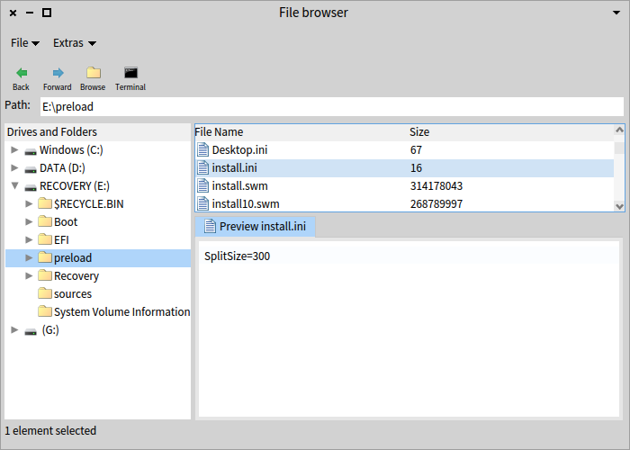
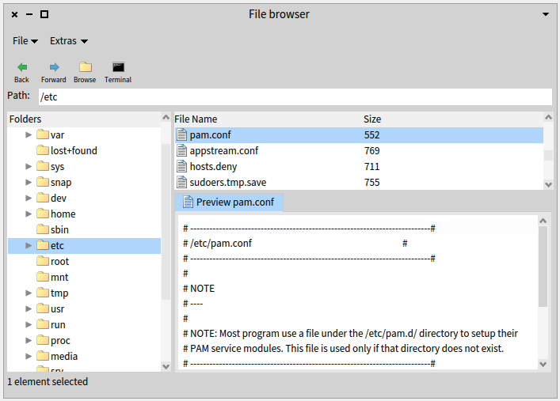

# Pharo-Harbour

A simple file browser implementation for Pharo written by T. Bergmann (Astares) in 2019. Meanwhile this is now part of standard Pharo image.

# Quick Start
## Installation

```Smalltalk
Metacello new 
	repository: 'github://astares/Pharo-Harbour/src';
	baseline: 'Harbour';
	load
```

Note: only works in Pharo 8 and later 

## Screnshot

### Windows


### Ubuntu

